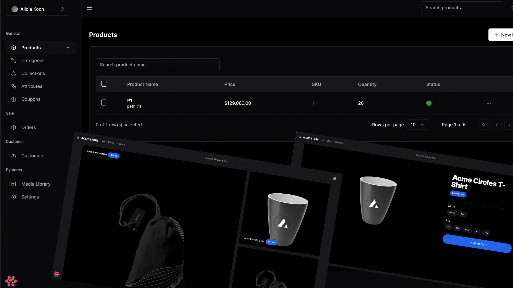

# Acme Store


## Tech Stack
- [Next.js](https://nextjs.org)
- [TRPC](https://trpc.io/)
- [Tailwind CSS](https://tailwindcss.com)
- [Next Auth](https://next-auth.js.org/)
- [Prisma ORM](https://www.prisma.io/)
- [Cloudinary](https://cloudinary.com/)
- [React Email](https://react.email)
- [Shadcn UI](https://ui.shadcn.com/)

## Features to be implemented

- [x] Authentication with **Next-Auth**
- [x] ORM using **Prisma ORM**
- [x] Database on **Mysql**
- [x] Caching query client on **@tanstack/react-query**
- [x] Validation with **Zod**
- [~] Role-based access-control
- [ ] Custom template email (reset password, forgot password, etc)
- [ ] File uploads with **Cloudinary**
- [~] Storefront with products, categories, and subcategories
- [ ] Checkout with **Paypal, COD, Backend Transfer**
- [ ] Admin dashboard with 
  - [ ] store information
  - [ ] products 
  - [ ] orders 
  - [ ] categories
  - [ ] collections 
  - [ ] attributes
  - [ ] subscriptions 
  - [ ] payments 
  - [ ] emails 
  - [ ] coupons
  - [ ] Media Library
<!-- - [x] User subscriptions with **Stripe** -->
<!-- - [x] Seller and customer workflows -->
<!-- - [x] Blog using **MDX** and **Contentlayer** -->
<!-- - [x] Newsletter subscription with **React Email** and **Resend** -->

## Getting Started

First, run the development server:

```bash
npm run dev
# or
yarn dev
# or
pnpm dev
```

Open [http://localhost:3000](http://localhost:3000) with your browser to see the result.

You can start editing the page by modifying `app/page.tsx`. The page auto-updates as you edit the file.

This project uses [`next/font`](https://nextjs.org/docs/basic-features/font-optimization) to automatically optimize and load Inter, a custom Google Font.

## Learn More

To learn more about Next.js, take a look at the following resources:

- [Next.js Documentation](https://nextjs.org/docs) - learn about Next.js features and API.
- [Learn Next.js](https://nextjs.org/learn) - an interactive Next.js tutorial.

You can check out [the Next.js GitHub repository](https://github.com/vercel/next.js/) - your feedback and contributions are welcome!

## Deploy on Vercel

The easiest way to deploy your Next.js app is to use the [Vercel Platform](https://vercel.com/new?utm_medium=default-template&filter=next.js&utm_source=create-next-app&utm_campaign=create-next-app-readme) from the creators of Next.js.

Check out our [Next.js deployment documentation](https://nextjs.org/docs/deployment) for more details.
